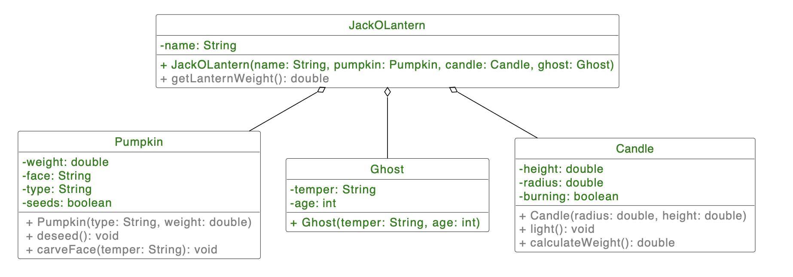

# H02E01 - Jack O'Lantern

This week you will use your new skills in object-oriented programming to create a jack o'lantern. First, you will have to prepare the materials used to build your jack-o'lantern, and after building it you will take part in a lantern competition.

## Explanation: Constructor with parameters

In the lecture, you learned that a constructor is used to create an object (an instance of a class). Other than that, a constructor with parameters can be used to initialize class attributes. This can be done as seen in the following example: The class Person has two attributes: a name and age. Let's say we want to create a new Person object with the name Luke, age 20. We can do this by calling the constructor taking two parameters  Person person = new Person("Luke", 20); To use this constructor, it has to exist in the Person class. The word this is used to access the class attribute.
```
Person(String name, int age) {
this.name = name;
this.age = age;
}
```
## Project Structure

In the template repository folder src/de/tum/in/ase you can find the file JackOLantern.java. Here, you can see a few TODOs for you to complete the exercise. The classes Pumpkin, Candle, and Ghost should be created in the same folder (src/de/tum/in/ase). You can use the main method of the class to test your implementation.

## Your Tasks

**1. Create the missing classes**

A jack o'lantern is composed of a Pumpkin that serves as a shell, a Candle to light it up and a Ghost inhabiting it. Create the missing classes and add their attributes. The class attributes can be seen in the UML model below.

**2. Write constructors**

To create objects and initialize attributes, constructors are needed. Constructors with parameters will be used to initialize class attributes. Make sure to write the parameters in the same order as seen in the UML model!

**3. Add getters and setters**

Create a getter and setter for each class attribute so that the values can be accessed from other classes. Note the convention for getters and setters: an attribute xx should have a getter called getXx(). For boolean attributes a getter should be isXx() and a setter should be setXx().

**4. Add methods**

Initially, every pumpkin comes with seeds that need to be removed. You will also have to light the candle up and, most importantly, carve a face that corresponds to the temper of the ghost. To do so, read the temper of your ghost and use it as a parameter for carving the face. Before the face has been carved, the pumpkin does not have a face (the attribute is set to an empty String). In the corresponding class, add and implement the methods deseed(), light(), and carveFace(String). These methods are used to set the values of attributes. Additionally, the method deseed() could also change the original weight of the pumpkin. (Details in the code)

**5. Implement the JackOLantern constructor**

Now you have everything you need to start building a jack o'lantern. Implement a constructor of class JackOLantern that sets attributes and calls necessary methods. In order to create a jack o'lantern the pumpkin needs to be deseeded and carved.

**6. Calculate the weight of the pumpkin**

Now you want to participate in a jack o'lantern competition. The judges want to know the weight of your pumpkin, but you don't have a scale, so you have to calculate it. You know the initial weight of the pumpkin, but it has lost 70% of its weight when deseeded.

**7. Calculate the weight of the candle**

The weight of the candle also needs to be considered when calculating the weight of the lantern. The candle can be approximated as a wax cylinder and can be calculated as
*π ⋅ r ² ⋅ h ⋅ 0.95 π⋅r 2 ⋅h⋅0.95*, the number *0.95* being wax density. We use *π = 3.14* for the calculation. The calculated result should be delivered as a result of the method calculateWeight().

**8. Weigh your lantern**

Calculate the weight of the lantern, knowing that the ghost does not weigh anything. Use the method getLanternWeight() to accomplish this. This method should return the calculated value as its result.



### Helpful Questions

When writing your constructors, ask yourself: What is the "real life object" I'm modeling like? E.g. does a pumpkin have seeds by nature?
