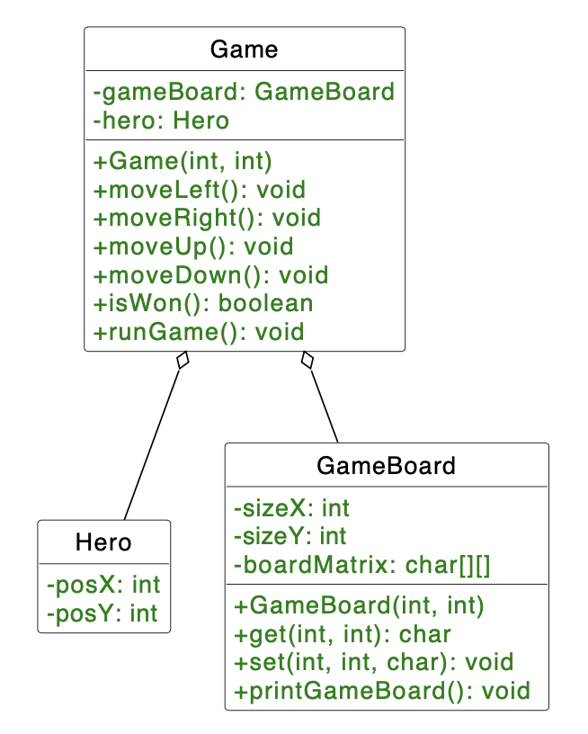

# H03E01 - Foundations of a Game

It's only a couple of weeks in the lecture, and now you're tasked with making a game! Oh, but don't worry, it's not that complicated at all. Let's start with the basics. In this game, you will help the Hero move through the field according to the user input. Let us make the gameboard, on which we can play and move our Hero in this exercise.

## Project Structure

In the template repository folder src/de/in/tum/ase you can find 3 empty classes. Game, GameBoard and Hero. You will implement your code into these 3 classes.

## Your Tasks

Let's do the Hero class first.

**1. Implement the Hero class**

Implement the Hero class as seen in the UML diagram. The Hero class has 2 attributes: posX and posY to represent the hero's position. The hero is initially on the coordinate (0,0), which is the top left corner of the GameBoard. Don't forget to implement the getters and setters.

Now move on to the GameBoard class.

**2. Implement the GameBoard class**

The GameBoard class has 3 attributes: sizeX and sizeY as the gameboard's size and a 2-dimensional char array named boardMatrix to represent our board. Your task is initializing:
- sizeX and sizeY in the constructor with the constuctor parameters. If either one of the attributes sizeX or sizeY are smaller than 3, then the respective attribute has to be set to 3.
- boardMatrix in the constructor and filling it with the char '_'. The '_' represents empty fields, in which our hero can step on during the game. Afterwards, the Hero is placed on the top left corner of the boardMatrix by placing the character 'H' in the position (0,0). At the bottom right we have our goal, which we represent with the char 'G'.

**3. Implement method get(int x, int y) and set(int x, int y, char value)**

The method get returns a char of the given position in the array (except it is outside of the board, then it returns the char '\0'), wheras the method set changes the character at the given coordinates to value (only if the given coordinates are inside the board). Remember that your boardMatrix should be formatted as boardMatrix[x][y].

**4. Implement printGameBoard()**

This method will print out the array on the console. Once again the top left corner is the (0,0). From (0,0) one step to the right is (1,0) and one step down is (0,1). After each row, there needs to be a linebreak. Follow the format shown in the example below.

Finally, let's combine those 2 into the Game class.

**5. Implement the Game class**

The Game class has 2 references to GameBoard and Hero. Both of them are initialized in the constructor Game(int sizeX, int sizeY). Don't forgett to add getters and setters for both attributes.

**6. Teach your Hero how to move**

Implement methods moveUp, moveDown, moveLeft, moveRight. The methods will change the position of the hero and also update the gameboard itself. Pay attention to handle situations where hero's position goes out of bound. Should the hero try to move towards outside of the gameboard, it must stay in its place. Print the message "The next move in this direction is outside of the game board, please try another move!" in this case.

**7. isWon()**

The method isWon() returns a boolean value which informs about whether the game has been won by the hero. In this early state the game cannot be lost, it's either ongoing or won. Return true if the Hero has reached the goal, i.e. if he is in the bottom right corner of the boardMatrix, else return false.

**8. Run the Game**

Finally, implement the runGame() method to run the game! A game is basically an unending loop until the win or lose condition is met (use isWon() for that). The win condition is for the hero to move and reach the goal, make use of the method you've implemented in the previous task for this purpose. In each loop:
- Print the gameboard onto the console.
- Read the user input to move the hero. Print out "Please enter the first letter of the desired direction:" before the player can input their commands. The input is expected to be the first letter of the direction in lowercase.
- Should the input be unreadable, print out "This input is not recognized, please enter again!".
- After the hero reaches the goal, break the loop and print out "Hero has reached the goal!".

You're done! You can use the main method as always to run your code and play the game on the console by calling runGame() on a Game object.