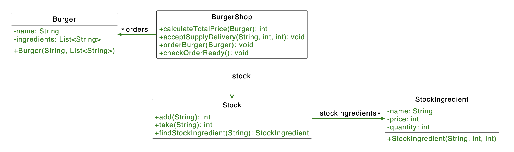

# H04E01 - Panic at Burger House

The penguins want to start a new business. They have very good management and cooking skills and even found an idea on how to cook burgers immediately when all the needed ingredients are in stock. Unfortunately, none of them learned programming at TUM so they need your help with the IT system for their new Burger Shops in Munich and Heilbronn.

Every hour the Burger House gets a delivery of fresh Ingredients, which are stored in the Stock.

## Your tasks:

**1. Add the classes**

The penguins found an external software architect who prepared a class diagram. Implement all classes according to the diagram below. Additionally, add getters for all the private fields. You need setters as well, in case of invalid input the setter is not expected to do anything.
In the StockIngredient and Burger classes, make sure that in case a null string or a negative integer is passed to a constructor, you have a default value to fallback to, for instance: "" for strings and 0 for integers. If such a invalid value is passed to a setter, it should not change the existing value. NOTE: For the StockIngredient constructor, the order of the parameters is: name, price, quantity.

We store all needed ingredients for a Burger as a List with the names of Ingredients. For example, Double-Cheeseburger might have 2 x "bun", 1 x "cutlet", 2 x "cheese".

IMPORTANT: Make sure to initialize the stockIngredients attribute, otherwise the tests will show a NullPointerException.

**Part 2: Stock**

Implement the methods add and take which increase or decrease the quantity of a Stock Ingredient given its name and return the new Stock quantity. If the operation cannot be completed (i.e. because no ingredient with the given name exists or the quantity cannot be lowered further), the method is expected to return -1. Additionally, we need findStockIngredient to search for an ingredient in stock by its name.

**Part 3: BurgerShop**

Now let's finally implement all the logic of the new Burger Shop. We will need calculateTotalPrice to calculate the net cost of the Burger. acceptSupplyDelivery is invoked when our supply chain partner delivers fresh Ingredients for our Burgers. It takes the name, its price, and the delivered quantity as parameters. It increases the quantity of its corresponding StockIngredient object by the given value. Also handle the case if no ingridient with the given name exists yet: Create a new object and add it to the stock.

**Part 4: BurgerShop**

The orderBurger is used when a customer places a new order. Due to expected high demand each order can consist of only one burger. Additionally, to avoid unfair waiting time all customers are served according to FIFO (First In, First Out), i.e., one cannot get his burger if there is a customer in front of him/her waiting for his/her order. The orderBurger method should add the burger to the list of orders and then make a call to the checkOrderReady() method, where you will implement the follwoing logic:
If all necessary Ingredients are in Stock, we can instantly cook a Burger and notify the customer that the burger is ready. Write "The order is ready: [Burger name]"" e.g.:

    The order is ready: Double-Cheeseburger

If we successfully cooked a burger the ingredients are taken from the stock, otherwise the stock is not changed.

checkOrderReady() serves as many burgers as possible until either:

- the order queue is empty or
- one order cannot be served due to missing ingredients.

In this case, exit the method. When another customer places an order, checkOrderReady() gets called again and tries to serve the orders. Don't forget to remove sucessfull orders from the queue.

You can use Main class to test your implementation, it will not be graded.