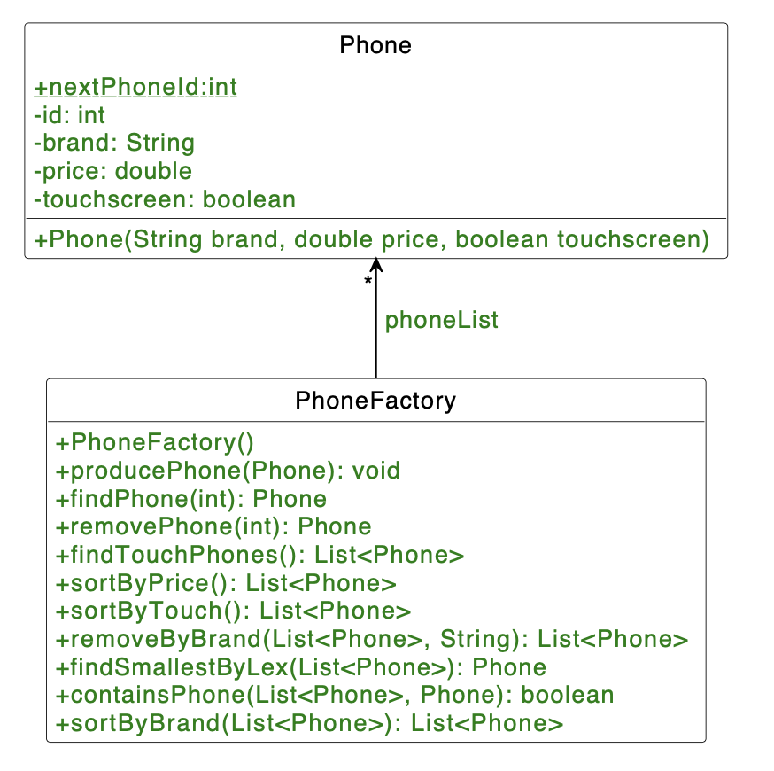

# H04E01 - Call Me Maybe

You have newly invested in a factory which produces phones. As an investor, you deeply care about the efficiency and performance of this phone factory. Therefore you have decided to implement a program which helps you list and sort the phones by their various qualitites.

## Project Structure

In the template repository folder src/de/in/tum/ase you can find the two classes Phone and PhoneFactory. You'll work on these classes and simulate the factory.

## Your Tasks



#### Part 1: Phone

1. **Phone Attributes**
Each phone, which has been created in the factory has a unique and unchangeable id. The first phone that has been created has the id 0 and the second phone, 1. In order to achieve this you will need the nextPhoneId attribute. The phones have a brand -represented as a String- and a price which has the type double. Additionally they can either have a touchscreen or not. Take a look at the UML diagram and implement the Phone class by adding getters and setters for the attributes id, brand, price, touchscreen.

#### Part 2: The Factory

1. **List of Phones**
The factory stores all its products as a List of Phone objects. Initialize this list in the constructor. You may notice that doing this by
```
phoneList = new List<Phone>();
```
causes a problem, since you are asked to implement all the default methods such as add or remove on your own. Instead, initialize your list as an ArrayList or a LinkedList. Don't forget to implement a getter and setter method for the phoneList attribute.

2. **producePhone(Phone phone)**
When this method is called on a Phone object, this phone is added to the phoneList.

3. **findPhone(int id)**
A phone's distinct id will help you find it. In this method, search through the entire phoneList and return the phone with the matching id. If a phone with the given id is not found in the phoneList or if the given id is invalid, return a new non-touchscreen phone object with the brand "" and price -1.

4. **removePhone(int id)**
Find and remove the phone with the given id from the phoneList and return the removed phone. If a phone with the given id doesn't exist in the phoneList, then create a new phone with the brand "", price -1 and without touchscreen feature and return this created phone.

5. **findTouchPhones()**
Touchscreen phones are very popular. Thus, you want to list them in a list with the help of this method. Iterate over the phoneList and store all touchscreen phones in a new list and return this list.

6. **containsPhone(List<Phone> phoneList, Phone phone)**
Check if the given phoneList contains the given phone. Return true if it does and false if it doesn't.

7. **removeByBrand(List phones, String brand)**
Remove all the phones with the brand from the list phones and return a list that doesn't contain phones of this brand. If brand or phones is null, return an empty list.

8. **findSmallestByLex(List phones)**
Implement a method that returns the phone with the lexicographically smallest brand. Hint: The compareTo-method is useful for the comparison between phones.

#### Part 3: Sorting

1. **sortByTouch()**
Store all the phones with a touchscreen in the beginning of a list, the rest of the phones at the end and return this list of phones. While doing the sorting don't use Java library sorting functions.

2. **sortByBrand(List phones)**
Sort the phones lexicographically according to their brand and return a list of sorted phones. While doing the sorting don't use Java library sorting functions.

3. **sortByPrice()**
Finally sort the list of phones according to their price in increasing order and return the sorted list. While doing the sorting don't change the order in the phoneList and don't use Java library sorting functions. You can use a simple sorting algorithm such as Bubble Sort.