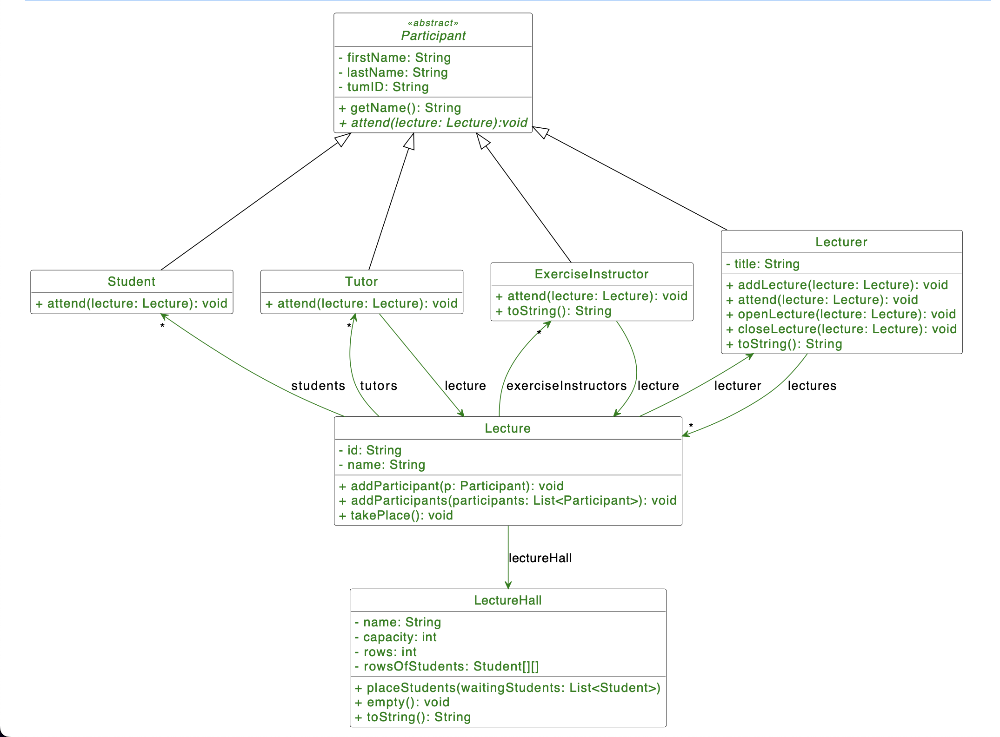

# H05E01 - Back to University

In this homework you are going to model one main aspect of university life: lectures and its participants. Since there are many reusable components you are going to use inheritance.

## Project Structure

In the template repository folder src/de/in/tum/ase you can only find one class Main, which you should use for testing purposes. Apart from that you should create many new classes as stated in the following tasks.

## Your Tasks



### Part 1: Participant

1. **Implement the Participant Class**
Create a new class Participant as shown in the UML diagram (also add getters). Add a constructor that takes the three attributes in the same order as shown in the UML diagram. This constructor should only be visible for subclasses.

2. **Implement all subclasses of Participant**
Create the classes Lecturer, ExerciseInstructor, Tutor and Student according to the diagram by using inheritance. All subclasses should provide a public constructor initializing all attributes.
In the classes Lecturer and Student the attend method should just add the according Participant by invoking the addParticipant method of Lecture, which wil be implemented later.
In the classes Tutor and ExerciseInstructor the attend method should be implemented as following: If the Tutor/ExerciseInstructor attends a Lecture he or she is not tutoring in, he/she gets added as a Student (a new student object must be created). Otherwise he/she gets added as explained above.
The openLecture method in Lecturer should print to console: `"Welcome to the lecture [name of lecture]! I'm Prof. [name of lecturer]."`
The closeLecture method in Lecturer should print to console: `"This is all for today. See you next week!"`
The getName() method in the Participant Class should return the following: `"[firstName] [lastName]"`
In addition the addLecture() method in the Lecturer Class should check if the passed Lecture already has a Lecturer or not. If the Lecture already has a Lecturer you should print out the following to the console: `"The lecture [lecture name] is already held by another lecturer."`. Otherwise, add the lecture to the list of lectures.
The toString() method in the Lecturer Class should return `"[title] [name]"`, in ExerciseInstructor `"Exercise Instructor [name]".`
Reminder: Try to put all functionality (attributes, methods) that is shared among all subclasses into the superclass. You can see the structure in the UML diagram as well.

### Part 2: Lecture

1. **Create the Lecture Class**
Create the Lecture class and implement the basic skeleton structure (attributes, constructor, empty methods, getters)

2. **Implement the addParticipant() and addParticipants() methods**
The method addParticipant adds a Participant to the according list (or attribute in case of Lecturer). For example if the participant is a Student he or she should be added to the list of students. The method addParticipants works pretty much the same. Only difference here is that the method parameter is a list of Participants, so the steps have to be done for every single Participant now.

Edge Cases where you must not add the Participant:

- If the Participant already exists, the getName method of Participant should be invoked and this message should be printed to console: `"[name] tumID:[tumID] already attends/holds the lecture."`
- There should only be one Lecturer. So if there already exists a different Lecturer the following should be printed to console: `"This lecture already has a lecturer!"`
- If the Participant is not a Lecturer, ExerciseInstructor, Tutor nor Student it should be displayed on console: `"No such participants allowed in this lecture!"`

### Part 3: LectureHall

1. **Create the LectureHall Class**
Create the LectureHall Class and all it's members (add getters). Add a public constructor that takes a name and the capacity. All Lecture Halls have a minimum capacity of 90. If the passed capacity is smaller than 90, the capacity of the constructed Lecture Hall should be manually set to 90. As each row should hold 30 Students, and we only want whole numbers of rows, we set the capacity to the lowest number divisible by 30 (e.g. given: 282 -> 270).
Helpful Questions:
- How can you calculate the amount of rows, if the capacity is given?
- What kind of Data structure is best suited to represent a lecture hall with multiple rows? How should the initlai state look like?

2. **Implement the placeStudents() method**
This method should take a list of Students and prints out the size of the list to the console: "Waiting students: [number of waiting students]"
Now it should be checked, if the amount of students is too big for the LectureHall. If this is the case, print out the following:
```
[name] hall doesn't have enough places for all the students!
We can place only the first [capacity] out of [number of waiting students] students.
```

Place all students on a free seat. The first student in the list should get placed at the first available seat in the front row (index 0) or in the next avaibilbe row with a free seat, if there are no more seats available in that row. Do this for all students.

If all waiting students have been placed on their seats print: `"All students are sitting in the lecture hall."`
In any case, print the current state of the lecture hall after this process was finished. Use the toString() method as shown in the next taks.

3. **Implement empty() and toString() methods**
The empty() method should clean up the LectureHall and remove all Students from it.
toString() should return a graphical representation of the LectureHall. It consists of the name of the LectureHall combined with a String representation of each seat. Empty seats should be depicted as "[]" occupied seats as "[nameOfStudent]". Use this as an example:
```
4. Rudolf Diesel hall:
Row 1: [Peter Otto][Tom Lillard][Leon Breitstuhl][Timo Sitzkurz]
Row 2: [Greg Shoemaker][][][]
```

### Part 4: It all comes together

Now that we are done with our setup we can use the classes we have created. In order to do that we will simulate some behaviour in the main() method of the Main class.

1. **Implement takePlace() in Lecture**
For this task implement the takePlace() method in Lecture so that it places all students in the LectureHall, opens the lecture, closes the lecture and removes all students from the lecture hall again.

2. **Implement the generateStudents()**
We want to be able to create a large amount of Students to fill up our LectureHall. In order to do that we implement the method generateStudents(). The method should return a list of Students.
Hint: to make it easier, you can just use the same name for every student but change the tumID a bit for every Student

3. **Implement the generateTutors() method**
Now do the same thing for the generateTutors() method. This method also needs a lecture which is passed to the method. Return your list of Tutors.
Hint: You can uncomment the lines in the main in method to test your program.


