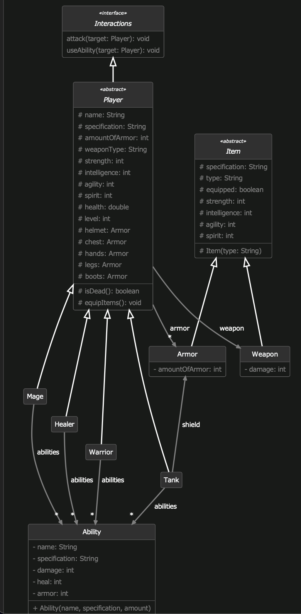

# H05E02 - The winner takes it all

Life is more fun if you play games. Do you like games? Your next challenge is to implement a game engine model. Take a careful look at the UML diagram below. Our game engine will have different player characters having weapons and abilities, the players can fight and attack each other.



## Your Tasks

1. **Part 1: Ability**

    Ability describes the player's fight abilities. All class attributes are expected to be private with corresponding getters. Additionally, please add a constructor with the parameters according to the diagram. The specification parameter refers to the player character(Mage, Tank, Healer, or Warrior). You can choose your own way how to handle the case of an incorrect name (we will not test this scenario). When initializing an ability, set the ability attributes depending on the player character and the table below. If the character does not have an ability attribute, set it to -1.

For example: Mage will get damage that equals to the passed amount. However, heal and armor must be set to -1.

|         | damage | heal | armor |
|---------|:------:|:----:|:-----:|
| Mage    |    ✔️   |      |       |
| Tank    |        |      |   ✔️   |
| Healer  |        |   ✔️  |       |
| Warrior |    ✔️   |      |       |

2. **Part 2: Items**

   Would you expect our players to fight with bare hands? Of course not! The players will be equipped with items. Implement the Item class and its subclasses according to the UML diagram above. All class members are protected. By default, the item is not equipped. Additionally, please add the following public constructors for Armor and Weapon. For optimizing the space, the UML diagram doesn't include them.

```
public Armor(String armorType, String specification, int amountOfArmor, int strength, int intelligence, int agility, int spirit)
public Weapon(String weaponType, String specification, int damage, int strength, int intelligence, int agility, int spirit)
```

3. **Part 3: Player**

   Implement the Player class according to the UML diagram above. The list of available player's armors is stored in the armor attribute. All players start on the first level and the player's health value is 200. The player can get the passed weapon only if this weapon is suitable for this player character and the weapon type matches player's weapon type. The equipItems method uses the available weapon and armor list. Armor should be equipped according to the type (Helmet, Chest, Hands, Legs, Boots) and for each type, only the first item should be equipped. After equipping, any item player's attributes should be changed accordingly. Same applies to equipping the weapon. All Player class members are protected. Player implements an interface Interactions which describes all game participants that can interact with each other. The methods should be declared in the interface and implemented in the Player's subclasses.

Important! equipItems() method should be called in subclasses' constructors for proper initialization.

Note: Please add the following constructor:

```
protected Player(String name, String specification, int amountOfArmor, List<Armor> armor, Weapon weapon, String weaponType)
```

4. **Part 4: Choose Your Fighter**

   There are four Player subclasses: Mage, Tank, Healer, and Warrior, each representing a player type. Below you will find a table with the attribute values for each type.

|         | strength | intelligence | agility | spirit | armor |
|---------|:--------:|:------------:|:-------:|:------:|:-----:|
| Mage    |     2    |      10      |    4    |    6   |   5   |
| Tank    |    15    |       4      |    6    |    2   |   30  |
| Healer  |     3    |       5      |    3    |   10   |   9   |
| Warrior |    20    |       2      |    8    |    2   |   15  |

We expect the following constructor parameters:

`(String name, List<Ability> abilities, List<Armor> armor, Weapon weapon, String weaponType)` for Warrior, Mage and Healer

`(String name, List<Ability> abilities, List<Armor> armor, Weapon weapon, String weaponType, Armor shield)` for the Tank class

5. **Optional Part 5: Attack!**

   In the next two parts, we will implement attack and useAbility methods for each player character. These parts are optional, you can earn up to 6 bonus points for them.

    In the next two parts, we will implement attack and useAbility methods for each player character. When attack method is called, the target can get some damage. After damaging a target we should always check if this is dead (target's health value = 0), and the player's level is increased by one. If the target is dead, the following message should be printed: "[Player Name] killed [Target Name]".

    The following output lines are expected in special cases:

    - `"You don't have a weapon to attack!"`
   - `"Target [Target Name] didn't receive any damage!"`
   
   Damage is calculated according to the following formula:

    *strength * k1 + weapon.getDamage() + agility * k2 - target.amountOfArmour()*

    If the damage is non-positive we assume that the target did not receive any damage.

|         |  k1 |  k2 |
|---------|:---:|:---:|
| Mage    | 0.4 | 0.4 |
| Tank    | 0.7 | 0.6 |
| Healer  | 0.2 | 0.1 |
| Warrior |  1  | 0.8 |

6. **Optional Part 6: Using abilities**

   In our game, a random ability will be used when calling useAbility method. You can check the official Java documentation to learn more about the Random class. The Healer uses his ability to heal his target, the Tank uses his ability to increase his armor and force his target to attack him, the Mage and the Warrior use their abilities to damage their targets. Be sure to use only the abilities that are suitable for the current character. If the enemy target died, the following message should be printed: "[Player Name] killed [Target Name]". Also, player's level should be increased by 1.

    To calculate the effect of the used ability use these formulas:

    - Healer: *spirit + ability.getHeal() + intelligence * 0.5*
    - Mage: *intelligence + ability.getDamage() + spirit 8 0.5 - target.amountOfArmour*
    - Warrior: *strength * 2 + ability.getDamage() - target.amountOfArmour*
    - Tank: when a tank uses his ability, the armor is increased and afterwards he deals with the enemy attack.

   The following output lines are expected in special cases:

    - `"[Player Name] has no spells to cast!"` - Mage/Healer
    - `"[Player Name] has no skills to use!" ` - Warrior/Tank
    - `"Target [Target Name] didn't receive any damage!"`
    - `"Can not heal [Target Name], [Target Name] is dead!"`
    - `Target [Target Name] didn't receive any damage!"`
    - `"Hey you! I am here, attack me!"` - Tank


Good luck!