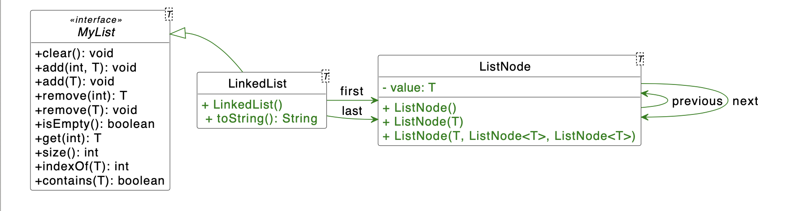
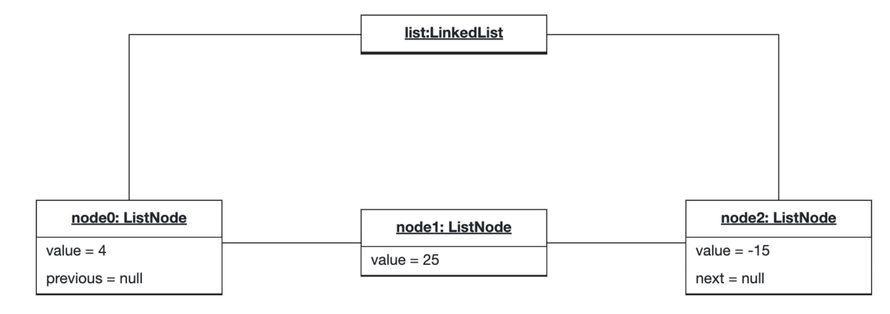
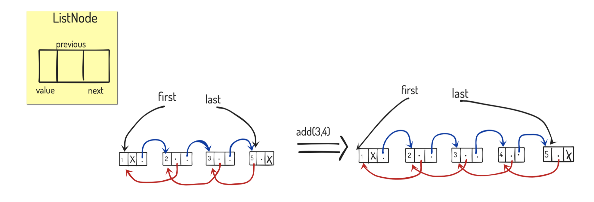

# H06E01 - Generic List

A linked list is a linear data structure, in which the elements are not stored at contiguous memory locations. The elements in a linked list are linked using pointers. In simple words, a linked list consists of nodes where each node contains a data field and a reference(link) to the previous and next node in the list.

Reference [GeeksForGeeks](https://www.geeksforgeeks.org/data-structures/linked-list/)

## Project Structure:

In this exercise, we will implement a LinkedList<T> class with nodes ListNode<T> which implements our defined interface MyList<T>. In the template repository folder src/de/tum/in/ase you can implement the required classes. To be able to use the list for different types of values, we make the list generic, and therefore make nodes hold values of type T. For testing purposes, there is a file called Main.java with the main method as well.

## UML Diagram

Below, you can find the UML diagram of the project. Don't forget to add getters and setters for all classes and make private all the attributes of LinkedList and ListNode.

### Example

This is what a linked list would look like if three values were added to an instance of LinkedList<Integer>:

## Your Tasks:

### Part 1: MyList

Get familiar (but don't change) with the custom-defined interface MyList - a smaller selection of methods defined in java.util.List. All the definitions of the methods can also be found in the [official documentation](https://docs.oracle.com/en/java/javase/17/docs/api/java.base/java/util/List.html).

### Part 2: LinkedList

1. **Create basic structures**

- Create the class LinkedList, which implements the interface MyList and has attributes defined in the UML above. 
- Create the class ListNode according to the UML with 3 constructors:
   - ListNode()
   - ListNode(T value)
   - ListNode(T value, ListNode<T> previous, ListNode<T> next)

### Part 3: LinkedList methods

1. **Add element to end of list**

   Implement the method add(T) that adds a new node with type T to the end of the linked list.

2. **Add an element into the list at the index**

   Implement the method add(int, T) that adds a value to the linked list at the specified index and shifts all the subsequent elements to the right. If the index is invalid, throw IndexOutOfBoundsException with a custom message: "List index is out of bound".

Note: some other methods might fail the tests in case you implement the add methods incorrectly.

**Example**

Consider this example of how the references should look like after add:

3. **Implement a toString() method**

   Implement the method toString() that returns a String and represents the content of the linked list. The return value should consist of the toString() return of every value, separated by , (a comma followed by a single space) and encapsulated in brackets: []

   For example: for a linked list with the values 1 to 4, the toString() method should return: [1, 2, 3, 4]

4. **Check if the list is empty**

   Implement the method isEmpty() that returns if the linked list contains any elements or not.

5. **Size of the list**

   Implement the method size() that returns the number of elements in the linked list.

6. **Clear list**

   Implement the method clear() that removes all the elements of the linked list.

7. **List contains a value**

   Implement the method contains(T) that checks if the linked list contains a specific element with type T or not.

8. **Get an element value at the index**

   Implement the method get(int) that returns the value of the node at the specified index in the linked list. Indices start with 0, of course. If the index is invalid, throw IndexOutOfBoundsException with a custom message: "List index is out of bound".

9. **First index of an element**

   Implement the method indexOf(T)that returns the first index of a given element if it is found. Otherwise, return -1.

10. **Remove an element from the list**

   Implement the method remove(T) that removes the first node (if it exists) with the value equal to the method parameter. If the element does not exist in the linked list, do nothing (do not throw an exception).

11. **Remove an element from the list at the index**

   Implement the method remove(int) that removes a value from the linked list at the specified index. If the index is invalid, throw IndexOutOfBoundsException with a custom message: "List index is out of bound".