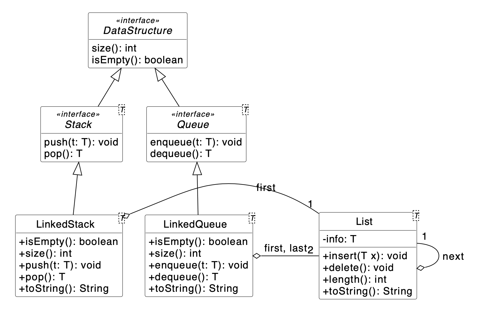
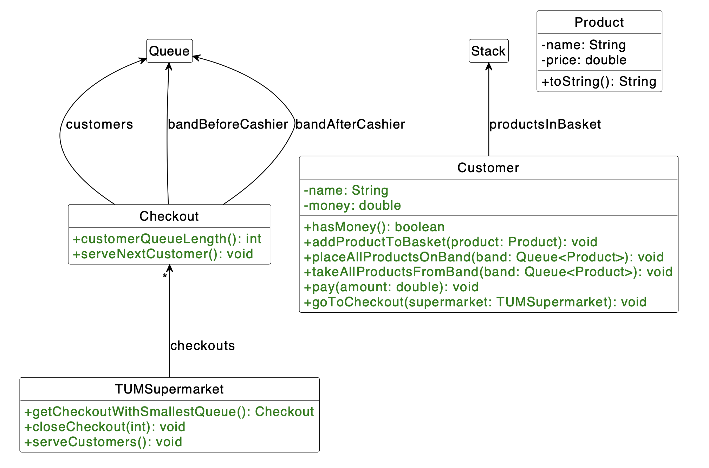

# TUM Supermarket

In this exercise, we want to implement generic data structures and apply them in our brand new TUM Supermarket!

### Part 1: Data Structures

In the first part of the exercise, we want you to improve the implementation of the interfaces List, DataStructure, Stack, and Queue with their implementations LinkedStack and LinkedQueue.

1. **Improve the List Class given in the template**
   You can find the List class in your repository. We now want to convert the Product-List implementation to a generic list. Replace Product with a generic type parameter and change the attributes to private. Mark the info attribute final. You do not need to insert validity tests.
   
Hint: The class Stack and Queue are interfaces that are implemented.

2. **Generic Interfaces**
   In your repository, you will also find the following classes:
    - A DataStructure interface. It defines the following methods:
      - a size() method that returns the number of stored elements as an int.
      - an isEmpty() method that returns a boolean whether the data structure is empty. 
    - A generic interface Stack extends the DataStructure and defines the following methods:
      - a push(T) method that adds an object of the generic type T to the stack.
      - a pop() method that removes an object of the generic type T from the stack. If the stack is empty, it returns null. 
    - A generic interface Queue extends the DataStructure and defines the following methods for this purpose:
      - an enqueue(T) method that adds an object of the generic type T to the queue.
      - a dequeue() method that removes an object of the generic type T from the queue. If the queue is empty, it returns null. 
    - A generic class LinkedStack that implements Stack and it's methods.
    - A generic class LinkedQueue that implements Queue and it's methods.
   
   NOTE: They also take Product as a parameter, which must be changed to a generic type parameter. Make sure that the methods and attributes in the UML are also correct.
      All data structures described here behave as they are known from the lecture.

### Part 2: Product

Now that we have created the data structures, we want to implement our Supermarket by using the created Classes. 

Note: This diagram omits the method implemented above for Queue and Stack.

1. **Improve Product class**

   You can find the already the class Product in your repository. Finish the implementation of this class: the constructor should throw an IllegalArgumentException if the name is null or if the price is 0 or smaller.

### Part 3: Customer

1. **Improve Customer class**

   You can find already implemented class Customer in your repository. Add all missing attributes and methods according to the UML diagram. The constructor should throw an IllegalArgumentException if the name is null or the Customer has a negative amount of money. Add getters for all attributes.

   - The hasMoney() method should return true if the money attribute is greater than 0.

   - The pay() method should remove the amount to pay from the money attribute. In the case where the consumer has an insufficient amount of money or if amount is negative, an UnsupportedOperationException should be thrown.

   - The addProductToBasket() method pushes the Product to the basket (Stack).

2. **Implement placeAllProductsOnBand()**

   Implement the placeAllProductsOnBand() method. This method should move the elements from the Customer basket (Stack) to the given product band (Queue).

   Hint: Stack uses LIFO principle and Queue uses FIFO principle.

3. **Implement takeAllProductsFromBand()**

   Implement the takeAllProductsFromBand() method. Implement this method analogously to the one from 2. Here the products should be put back in the Customers basket (Stack) and be removed from the product band (Queue).

### Part 4: Checkout

We also want to have different Checkouts so that our supermarket can support lots of Customers.

1. **Checkout Skeleton Structure and implementation of basic methods**

   Create all the attributes and methods according to the UML diagram. The constructor should instantiate all the attributes (customers, bandBeforeCashier, bandAfterCashier) with LinkedQueue. Add the getters for all attributes.

2. **Implement serveNextCustomer()**

   An empty queue should throw an UnsupportedOperationException since no Customer is waiting. The next Customer should be dequeued from the Queue and put all his/her products on the band before the cashier. After that every product from the current customer should be scanned and added to the Queue after the cashier. The customer should then put the products back in their basket. After all products have been scanned, the total sum should be payed by the Customer.

### Part 5: TUMSupermarket

Now we finally create our TUMSupermarket Class.

1. **Implement the constructor**

   The constructor should take the number of Checkouts as a parameter (throw an IllegalArgumentException if the number is 0 or smaller) and create a new Checkout array. Initialize the array-elements with newly created object.

2. **Implement getCheckoutWithSmallestQueue()**

   This method should return the Checkout with the smallest Queue of waiting customers.

3. **Implement serveCustomers()**

   For each Checkout the next Customer should be served.

4. **Implement closeCheckout()**

   This method should delete the Checkout-object with the given index. If the index doesn't exist, an IllegalArgumentException should be thrown. Otherwise, the size of the Checkout array must be decreased by 1 (-> there has to be no null-value in it) and it should contain all the other Checkout-objects in the same order as before. Then all Customers from the removed Checkout must go to the next-shortest Queue.

   NOTE:Pay attention that the last Customer of the deleted Checkout is the first who leaves the Queue.

5. **Implement goToCheckout() in Customer**

   The method should check if the TUMSupermarket-object passed to the method is null. If so, throw an IllegalArgumentException. The customer should choose the Checkout with the shortest Queue and enqueue herself/himself to the other customers.

   Helpful Question: Which method from the TUMSupermarket class could be helpful here? Have a look at the UML diagram
