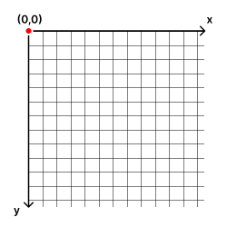

# H11E02 - TUM Triangle

Let's create some art! In this exercise you will step into recursion and draw the so-called TUM triangle using a recursive method. The TUM Triangle is shown below:

*(A TUM triangle with recursion depth=7)*

## Your task:

1. **Implement createTUMTriangle()**

    Implement the method createTUMTriangle(double top, double left, double height, int depth) in the TUMTriangle class using recursion. It recursively adds instances of Triangles, that create the TUM triangle, to the triangles attribute in the class. If you do not use recursion (inside the method or in helper methods), you will not receive any points.

    For depth == 0, the triangles list should be empty.

    For depth == 1, Create the triangle using one big blue triangle and one small white triangle. Each triangle should have the same length on all sides. For higher depth, create the recusive triangle as shown in the animation above. The attributes top and left shift the triangle in the viewport (in other words move it down / to the left). Below you can find a picture showing the coordinate system of the viewport.

## Hints / Helpful questions

- Keep in mind to add the triangles in the right order. Otherwise some triangles could be painted over and not be visible.

- The height parameter refers to the length of the left side of the big blue triangle, not the mathematical height of the triangle.
